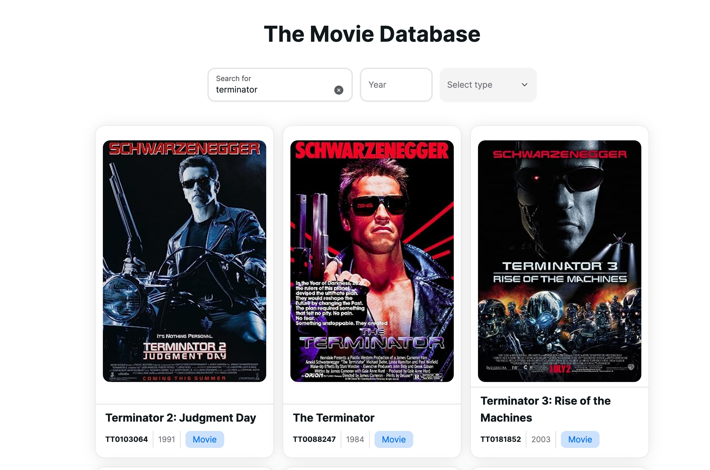
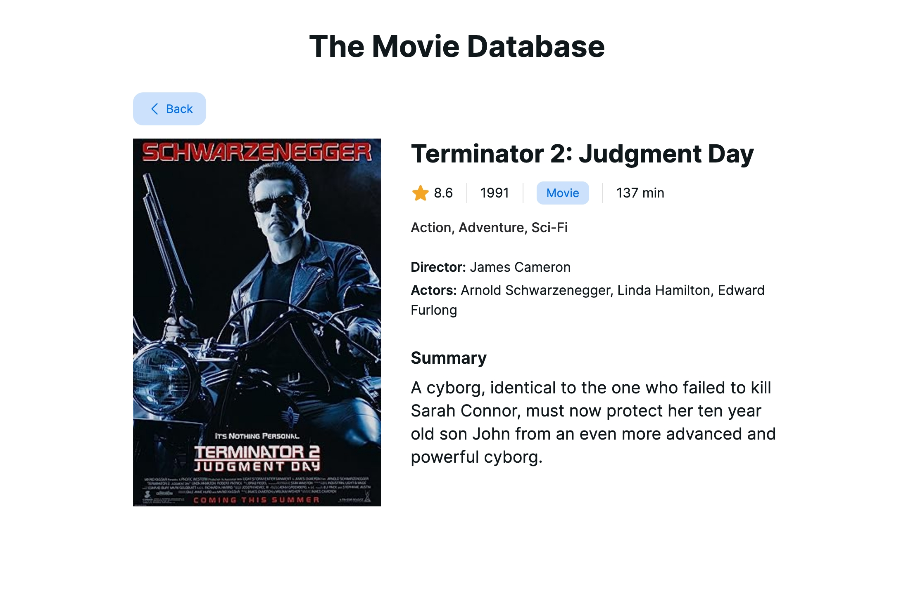

# The Movie Database

Invent Analytics FE Developer Case. This project uses the [The OMDB API](https://www.omdbapi.com/) to display a list of movies and their details.

## Getting Started

Use the node version specified in `.node-version`.

Project uses [pnpm](https://pnpm.io/) as package manager. If you don't have it installed, you can install it by running:

```bash
npm install -g pnpm
```

Install the dependencies:

```bash
pnpm install
```

Copy `.env.example` file to `.env.local` and add your API key:

```bash
cp .env.example .env.local
```

Run the development server:

```bash
pnpm dev
```

## Project Structure

- `src/assets/` - Icons, etc.
- `src/features/movies/` - Movies feature. Contains reducers, actions, components..
- `src/hooks/`
- `src/layouts/`
- `src/pages/`
- `src/store/` - Redux store

## Screenshots




